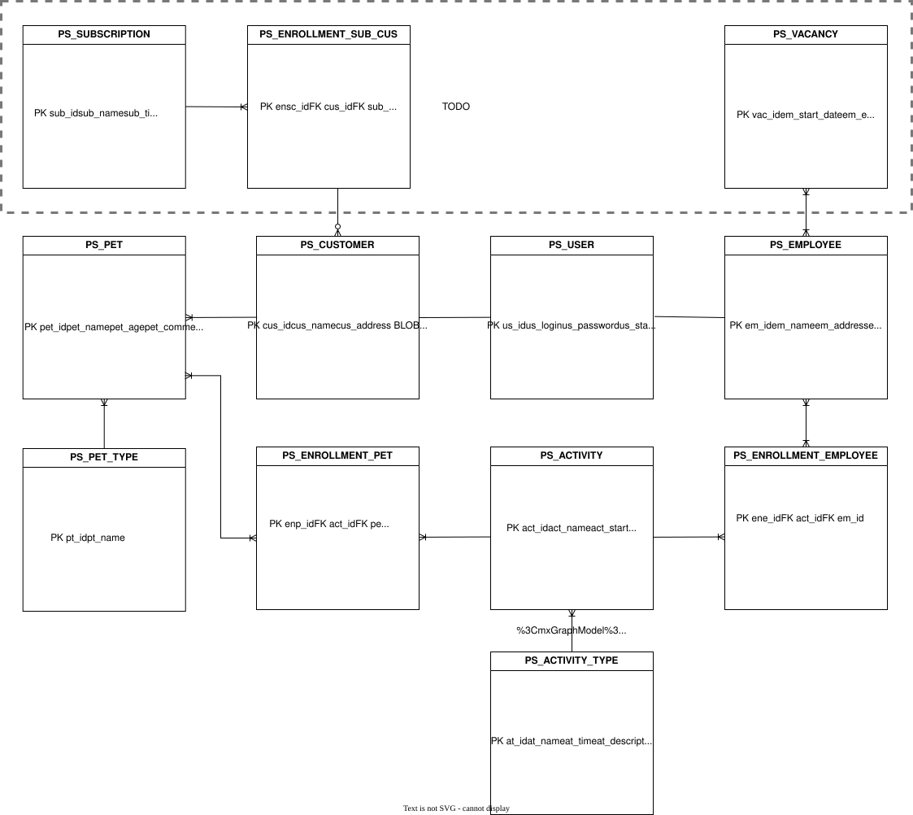

# Pet Sitter — HYF Belgium Java Final Project

A full-stack pet-sitting management application: It lets customers register, add their own pets and enrol them into activities, Admin manage activities, add employees and enrolthem into activities.
Back end =>  Spring Boot REST API
Front end => Angular 21. 

### Special thanks to Bora and his Movie application
https://github.com/MustafaBora/spring-boot-movie/

---

## Table of Contents

- [Overview](#overview)
- [Tech Stack](#tech-stack)
- [Project Structure](#project-structure)
- [Prerequisites](#prerequisites)
- [Authentication & Roles](#authentication--roles)
- [API Reference](#api-reference)
- [Environment Variables](#environment-variables)
- [Database](#database)

---

## Overview


- User registration & login | JWT-based authentication:
- - User registration => a customer is created.
- - Employee creation => a user is created 
- Customer profiles:
- - A customer add - update - delete his own profile
- - A customer add - update - delete his own pets
- -  Enroll / unenroll his own pets to activities
- Activity scheduling | Create timed activities with an activity type (e.g medium walk...) |
- Enrolments => Enrol pets and employees into activities. 
- Planning view => Calendar-style overview of all activities.
- Role-based access => CUSTOMER / EMPLOYEE / ADMIN permissions. 
- - ADMIN is extended from EMPLOYEE

---

## Tech Stack

### Backend (`pet-sitter/`)

| Layer | Technology |
|---|---|
| Language | Java 21 |
| Framework | Spring Boot 3.4.4 |
| Persistence | Spring Data JPA / Hibernate + PostgreSQL |
| Security | Spring Security + JWT (jjwt 0.11.5) |
| Validation | Jakarta Bean Validation |
| Mapping | MapStruct 1.5.5 |
| Boilerplate reduction | Lombok 1.18.46 |
| API docs | SpringDoc OpenAPI 3 / Swagger UI |
| Logging | AOP-based logging aspect + Logback |
| Testing | JUnit 5 + Mockito + H2 (in-memory) |

### Frontend (`pet-sitter-angular/`)

| Layer | Technology |
|---|---|
| Framework | Angular 21 |
| UI components | Angular Material 21 + Angular CDK |
| Styling | Tailwind CSS 4 + SCSS |
| HTTP | Angular HttpClient (proxied to `localhost:8085`) |
| Auth | JWT decode (`jwt-decode`) |
| Testing | Karma + Jasmine |

---

## Project Structure

```
HYFBE-java-pet-sitter/
├── pet-sitter/                  # Spring Boot backend
│   └── src/main/java/com/hyfbe/pet_sitter/
│       ├── config/              # CORS, OpenAPI configuration
│       ├── controller/          # REST controllers (user, customer, employee, pet, activity, enrolment)
│       ├── dto/                 # Request / Response DTOs
│       ├── enums/               # Role, AType
│       ├── exception/           # Custom exceptions
│       ├── handler/             # Global exception handler
│       ├── mapper/              # MapStruct mappers
│       ├── model/               # JPA entities
│       ├── repository/          # Spring Data repositories
│       ├── security/            # JWT filter, JWT utils, SecurityConfig
│       └── service/             # Business logic
└── pet-sitter-angular/          # Angular frontend
    └── src/app/
        ├── auth/                # Auth guards / interceptors
        ├── components/          # Feature components (planning, auth, customer, employee, pet)
        ├── models/              # TypeScript interfaces
        └── services/            # HTTP services
```

---

## Prerequisites

- Java 21+
- Maven 3.9+
- Node.js 20+ and npm
- Angular CLI 21 (`npm install -g @angular/cli`)
- PostgreSQL 14+

---


## Authentication & Roles

The API uses stateless JWT authentication. Tokens are returned on login and must be sent in the `Authorization: Bearer <token>` header.

| Role | Capabilities |
|---|---|
| `CUSTOMER` | Manage own profile, manage own pets, enrol own pets into activities (TODO : manage his own subscriptions) |
| `EMPLOYEE` | View customer list, Manage own profile (TODO : manage his own vacancies) |
| `ADMIN` | Full access to all resources | manage employees enrollments. Create - delete employees.

**Register:** `POST /api/v1/user/register`  
**Login:** `POST /api/v1/user/login` → returns `{ token, refreshToken }`

Token expiry: **3 hours** (access) / **7 days** (refresh).

---

## API Reference

| Resource | Base path |
|---|---|
| Users | `/api/v1/user` |
| Customers | `/api/v1/customer` |
| Employees | `/api/v1/employee` |
| Pets | `/api/v1/pet` |
| Pet Type | `/api/v1/pet-type` |
| Activities | `/api/v1/activity` |
| Activity types | `/api/v1/activity-type` |
| Pet enrolments | `/api/v1/pet/enrolment` |
| Employee enrolments | `/api/v1/employee/enrolment` |


---

## Environment Variables

| Variable | Description | Default (dev only) |
|---|---|---|
| `JWT_SECRET` | Base64-encoded secret for signing JWTs | Hardcoded dev value — **never use in production** |

In production, always set `JWT_SECRET` via an environment variable or secrets manager and remove the fallback from `application-dev.properties`.

---

## Database



Hibernate is configured with `ddl-auto=update`, so tables are created/updated automatically on startup. The PostgreSQL dialect is set to `org.hibernate.dialect.PostgreSQLDialect`.

Main entities: `User`, `Customer`, `Employee`, `Pet`, `PetType`, `Activity`, `ActivityType`, `PetEnrolment`, `EmployeeEnrolment`.
